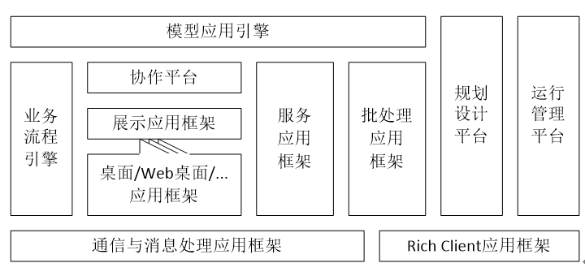
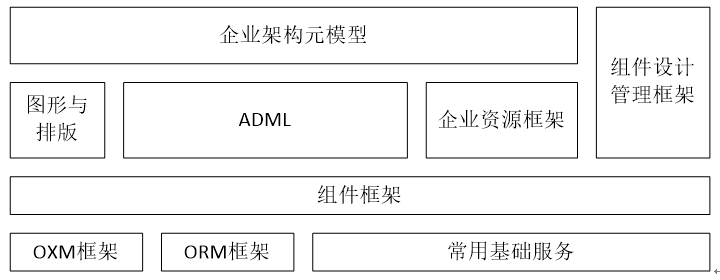

1、arky的定位和目标
-------------------

arky是EFS——领驭框架软件公司（Enterprise Framework
Software，简称EFS）创立的一个开源项目，旨在为企业应用的开发提供一个架构卓越的，高品质的，高可维护的（代码非常精炼，并且容易理解），技术支撑全面、完整的，应用开发既敏捷高效、又规范有序的业务基础平台。

arky是architecture的简写，这个名字既暗示了这个项目所面向的用户群体——架构师，和那些渴望成为架构师的普通开发人员；也暗示了这个项目的目标——帮助更多有潜质的人成为优秀的架构师，以及帮助更多的组织构建优秀的IT架构。

2、arky的构成
-------------

arky的代码都来自EFS久经锤炼的业务基础平台软件产品CBF——创造者业务框架（Creator’s
Business
Framework，简称CBF）。CBF的理念、技术在大型商业银行最关键、最重要的应用系统中得到了充分的验证——

-   CBF是第一个在银行核心应用领域得到成功的、全面运用的业务基础平台——新疆联社的信用卡业务系统，中信银行的核心系统，...。

-   CBF是第一个可以对全类型应用提供封闭支撑的业务基础平台——无论是后台联机交易处理应用，还是批量的数据统计、分析应用，或是WEB应用，WINDOWS桌面应用，手机和PAD上的APP，都可以运用CBF开发。

-   CBF提供了第一个专用于企业应用的、完全支持可视化设计的、面向对象的开发语言ADML。

-   CBF是第一个同时提供两个版本（Java/.NET）运行时支持的业务基础平台——应用开发成果无需修改，就可以在两大主流基础架构JVM和.NET
    Framework上，进行部署切换。

-   CBF第一个抽象出全行业通用的企业架构元模型并提供专用的企业架构管理视图。

-   CBF是第一个用作面向超大用户群和应用群的PaaS的业务基础平台——以CBF为基础开发的、目前已经拥有数十万用户的互联网业务平台融合市场，不仅仅提供了丰富的金融/商贸业务模型，供参与者进场直接操作，还向参与者开放了业务模型的定制、扩展和研发。

我们将按照CBF的架构逐步扩充arky的内容。在不远的将来，arky将包括以下一系列应用框架和开发、管理工具：

  
1.  通信与消息处理应用框架

2.  Rich Client应用框架

3.  业务流程引擎

4.  展示应用框架，也称展示层应用框架，是为操作者提供UI展现的前端系统的应用框架，分为桌面、Web桌面、移动设备、电话等多个版本。

5.  协作平台，是为业务专家提供的，用于对业务操作人员和客户提供在线支持、协作的操作平台，它集成了协作任务管理、多媒体即时通信和基于展示应用框架的远程协作功能。

6.  服务应用框架，是SOA中最关键、最重要的基础设施，用以快速构建高质量的、标准化的服务层应用，例如WebService。可取代传统OLTP中间件。

7.  批处理应用框架，用以构建非实时、大批量数据处理类的应用（这些应用也被称为批处理应用，例如，银行夜间进行的账务数据加工，统计与报表生成，数据分析与挖掘，等等）。

8.  模型应用引擎，是基于通信与消息处理应用框架、展示应用框架、服务应用框架和批处理应用框架等构建的一组特殊的应用组件，这些组件可加载、执行使用一种特殊的面向业务设计人员的设计语言（ADML）来描述的业务逻辑（这些业务逻辑我们也称之为“ADML应用”）。实际上，在arky上开发业务应用，主要的模式就是在架构定义的基础上设计ADML应用，而不是普通的编程，所产生的成果（架构定义及ADML应用）高度简洁、直观，被称为“业务模型”，而用以加载、运行“业务模型”的组件也就自然而然地被称为“模型应用引擎”。

9.  规划设计平台，用以进行企业级的架构规划，定义、管理各种架构元素，并在此基础上进一步开发、设计相关的ADML应用。

10. 运行管理平台，用以对基于arky建立的应用系统提供基本的运行管理功能，这些管理功能大多是针对应用框架本身的，例如，相关的企业资源的管理，以及系统的开关、监控和日志的管理与维护。

以及一些更重要、更关键的基础组件：

 
1.  常用基础服务，包括基于ODBC/JDBC、具有多种DBMS接口自适应能力的Sql服务，以及基于通信与消息处理应用框架的时钟服务、信号服务、共享资源服务等。

2.  OXM框架，用以实现对象与XML文档的映射的相关接口和辅助设施。

3.  ORM框架，用以实现对象与关系数据库的映射的相关接口和辅助设施。

4.  组件框架，组件对象类库的基本框架，包括：标准的组件基类，用作组件对象最基本构成要素的元素对象类，集合型组件，组件工厂，等等，用以定义、组装、登记自描述构造、可通过组件设计器查看和设置对象状态的组件。

5.  图形与排版，封装了一些常用的图形对象类和操作方法，以及常用的排版器类。

6.  ADML，一种特殊的面向业务设计人员的设计语言的定义及相关的执行部件。在语言的元模型层面，ADML与一般的面向对象的编程语言（Java/C\#...）基本相同，且元模型具备可扩展性；在专用的设计器（由规划设计平台提供）中，ADML应用以图形方式展现，极为直观；设计器还提供ADML参数提示与强大的智能感知输入功能，并醒目显示设计中的错误；规划设计平台还为ADML提供了真正的调试器和强大的调试功能。

7.  企业资源框架，是一套普遍适用的、可扩展的企业资源对象类库的基本框架，它封装了帮助应用访问和管理资源的对象类，指明了企业有哪些需要统一管理的资源，这些资源所对应的对象的属性、方法和事件。

8.  企业架构元模型，描述了企业架构的一种典型（基于TOGAF模型）的规划方法，指出在开展所谓企业架构规划与管理工作时，究竟需要定义和管理哪些要素，这些要素的属性和相互关系，并提供了帮助应用访问和管理架构定义的对象类库。

9.  组件设计管理框架，基于Rich
    Client应用框架的组件设计器和组件管理器的开发框架，并包含了一组基本的组件设计器（例如ADML设计器）和管理器（例如企业资源管理器）。

最终完成的arky就是CBF的开源版本，它将帮助所有开发组织：

-   以很低成本获得应对一切应用需求的能力——arky可支持所有类型企业应用的开发，包括：前端的展示层应用（包括WINDOWS桌面应用、WEB应用和移动设备应用），后端的联机交易和批处理应用（包括ESB、统计分析与报表应用），等等，适用性甚至超过Java，.NET等通用开发技术。

-   轻松构建技术品质要求极高（辅助功能齐全，处理性能高，运行可靠稳定，技术架构适应性强，标准化程度高，部署灵活）、高附加值的应用系统——包括大型商业银行的核心系统，云计算时代主流的SaaS应用系统，等等。

-   实现规范有序的应用开发，确保长期的持续发展和高效创新——这对应用体系庞大，功能不断扩展，对成果可管理性要求高的用户（金融机构、军政部门、医院、大型企业，以及在这些行业开发应用软件产品的ISV）极具价值。

-   实现敏捷高效的应用开发，并大幅降低开发成本——arky开发工具高度智能，操作简便快捷；应用开发完全围绕业务逻辑，无需考虑底层技术，BUG出现概率大大降低，即便出现也能很快解决。

-   大幅降低对开发人员能力要求——arky门槛低，学习快，应用开发成果清晰、直观，设计思路容易传承，使得开发组织能够更好地控制人力资源成本，更好地应对人员流动。

3、arky的路线图
---------------

<table class="MsoTableGrid" border="1" cellspacing="0" cellpadding="0" width="568" style="border-collapse:collapse;mso-table-layout-alt:fixed;border:none;
 mso-border-alt:solid black .5pt;mso-border-themecolor:text1;mso-yfti-tbllook:
 1184;mso-padding-alt:0cm 5.4pt 0cm 5.4pt">
 <tbody><tr style="mso-yfti-irow:0;mso-yfti-firstrow:yes">
  <td width="568" colspan="3" valign="top" style="width:426.1pt;border:solid black 1.0pt;
  mso-border-themecolor:text1;mso-border-alt:solid black .5pt;mso-border-themecolor:
  text1;padding:0cm 5.4pt 0cm 5.4pt">
  
<o:p>&nbsp;</o:p>

  
2017年发布计划

  
<o:p>&nbsp;</o:p>

  </td>
 </tr>
 <tr style="mso-yfti-irow:1">
  <td width="114" rowspan="8" style="width:85.15pt;border:solid black 1.0pt;
  mso-border-themecolor:text1;border-top:none;mso-border-top-alt:solid black .5pt;
  mso-border-top-themecolor:text1;mso-border-alt:solid black .5pt;mso-border-themecolor:
  text1;padding:0cm 5.4pt 0cm 5.4pt">
  
5月30日

  </td>
  <td width="243" valign="top" style="width:182.4pt;border-top:none;border-left:
  none;border-bottom:solid black 1.0pt;mso-border-bottom-themecolor:text1;
  border-right:solid black 1.0pt;mso-border-right-themecolor:text1;mso-border-top-alt:
  solid black .5pt;mso-border-top-themecolor:text1;mso-border-left-alt:solid black .5pt;
  mso-border-left-themecolor:text1;mso-border-alt:solid black .5pt;mso-border-themecolor:
  text1;background:#F2F2F2;mso-background-themecolor:background1;mso-background-themeshade:
  242;padding:0cm 5.4pt 0cm 5.4pt">
  
开源代码包

  </td>
  <td width="211" valign="top" style="width:158.55pt;border-top:none;border-left:
  none;border-bottom:solid black 1.0pt;mso-border-bottom-themecolor:text1;
  border-right:solid black 1.0pt;mso-border-right-themecolor:text1;mso-border-top-alt:
  solid black .5pt;mso-border-top-themecolor:text1;mso-border-left-alt:solid black .5pt;
  mso-border-left-themecolor:text1;mso-border-alt:solid black .5pt;mso-border-themecolor:
  text1;background:#F2F2F2;mso-background-themecolor:background1;mso-background-themeshade:
  242;padding:0cm 5.4pt 0cm 5.4pt">
  
归属

  </td>
 </tr>
 <tr style="mso-yfti-irow:2">
  <td width="243" valign="top" style="width:182.4pt;border-top:none;border-left:
  none;border-bottom:solid black 1.0pt;mso-border-bottom-themecolor:text1;
  border-right:solid black 1.0pt;mso-border-right-themecolor:text1;mso-border-top-alt:
  solid black .5pt;mso-border-top-themecolor:text1;mso-border-left-alt:solid black .5pt;
  mso-border-left-themecolor:text1;mso-border-alt:solid black .5pt;mso-border-themecolor:
  text1;padding:0cm 5.4pt 0cm 5.4pt">
  
基本公共类和接口

  </td>
  <td width="211" valign="top" style="width:158.55pt;border-top:none;border-left:
  none;border-bottom:solid black 1.0pt;mso-border-bottom-themecolor:text1;
  border-right:solid black 1.0pt;mso-border-right-themecolor:text1;mso-border-top-alt:
  solid black .5pt;mso-border-top-themecolor:text1;mso-border-left-alt:solid black .5pt;
  mso-border-left-themecolor:text1;mso-border-alt:solid black .5pt;mso-border-themecolor:
  text1;padding:0cm 5.4pt 0cm 5.4pt">
  
<o:p>&nbsp;</o:p>

  </td>
 </tr>
 <tr style="mso-yfti-irow:3">
  <td width="243" valign="top" style="width:182.4pt;border-top:none;border-left:
  none;border-bottom:solid black 1.0pt;mso-border-bottom-themecolor:text1;
  border-right:solid black 1.0pt;mso-border-right-themecolor:text1;mso-border-top-alt:
  solid black .5pt;mso-border-top-themecolor:text1;mso-border-left-alt:solid black .5pt;
  mso-border-left-themecolor:text1;mso-border-alt:solid black .5pt;mso-border-themecolor:
  text1;padding:0cm 5.4pt 0cm 5.4pt">
  
oxm

  </td>
  <td width="211" valign="top" style="width:158.55pt;border-top:none;border-left:
  none;border-bottom:solid black 1.0pt;mso-border-bottom-themecolor:text1;
  border-right:solid black 1.0pt;mso-border-right-themecolor:text1;mso-border-top-alt:
  solid black .5pt;mso-border-top-themecolor:text1;mso-border-left-alt:solid black .5pt;
  mso-border-left-themecolor:text1;mso-border-alt:solid black .5pt;mso-border-themecolor:
  text1;padding:0cm 5.4pt 0cm 5.4pt">
  
OXM框架

  </td>
 </tr>
 <tr style="mso-yfti-irow:4">
  <td width="243" valign="top" style="width:182.4pt;border-top:none;border-left:
  none;border-bottom:solid black 1.0pt;mso-border-bottom-themecolor:text1;
  border-right:solid windowtext 1.0pt;mso-border-top-alt:solid black .5pt;
  mso-border-top-themecolor:text1;mso-border-left-alt:solid black .5pt;
  mso-border-left-themecolor:text1;mso-border-alt:solid black .5pt;mso-border-themecolor:
  text1;mso-border-right-alt:solid windowtext .5pt;padding:0cm 5.4pt 0cm 5.4pt">
  
component

  </td>
  <td width="211" valign="top" style="width:158.55pt;border-top:none;border-left:
  none;border-bottom:solid black 1.0pt;mso-border-bottom-themecolor:text1;
  border-right:solid black 1.0pt;mso-border-right-themecolor:text1;mso-border-top-alt:
  solid black .5pt;mso-border-top-themecolor:text1;mso-border-left-alt:solid windowtext .5pt;
  mso-border-alt:solid black .5pt;mso-border-themecolor:text1;mso-border-left-alt:
  solid windowtext .5pt;padding:0cm 5.4pt 0cm 5.4pt">
  
组件框架

  </td>
 </tr>
 <tr style="mso-yfti-irow:5">
  <td width="243" valign="top" style="width:182.4pt;border-top:none;border-left:
  none;border-bottom:solid black 1.0pt;mso-border-bottom-themecolor:text1;
  border-right:solid windowtext 1.0pt;mso-border-top-alt:solid black .5pt;
  mso-border-top-themecolor:text1;mso-border-left-alt:solid black .5pt;
  mso-border-left-themecolor:text1;mso-border-alt:solid black .5pt;mso-border-themecolor:
  text1;mso-border-right-alt:solid windowtext .5pt;background:#F2F2F2;
  mso-background-themecolor:background1;mso-background-themeshade:242;
  padding:0cm 5.4pt 0cm 5.4pt">
  
附带的CBF工具

  </td>
  <td width="211" valign="top" style="width:158.55pt;border-top:none;border-left:
  none;border-bottom:solid black 1.0pt;mso-border-bottom-themecolor:text1;
  border-right:solid black 1.0pt;mso-border-right-themecolor:text1;mso-border-top-alt:
  solid black .5pt;mso-border-top-themecolor:text1;mso-border-left-alt:solid windowtext .5pt;
  mso-border-alt:solid black .5pt;mso-border-themecolor:text1;mso-border-left-alt:
  solid windowtext .5pt;background:#F2F2F2;mso-background-themecolor:background1;
  mso-background-themeshade:242;padding:0cm 5.4pt 0cm 5.4pt">
  
归属

  </td>
 </tr>
 <tr style="mso-yfti-irow:6">
  <td width="243" valign="top" style="width:182.4pt;border-top:none;border-left:
  none;border-bottom:solid black 1.0pt;mso-border-bottom-themecolor:text1;
  border-right:solid black 1.0pt;mso-border-right-themecolor:text1;mso-border-top-alt:
  solid black .5pt;mso-border-top-themecolor:text1;mso-border-left-alt:solid black .5pt;
  mso-border-left-themecolor:text1;mso-border-alt:solid black .5pt;mso-border-themecolor:
  text1;padding:0cm 5.4pt 0cm 5.4pt">
  
工作台

  </td>
  <td width="211" valign="top" style="width:158.55pt;border-top:none;border-left:
  none;border-bottom:solid black 1.0pt;mso-border-bottom-themecolor:text1;
  border-right:solid black 1.0pt;mso-border-right-themecolor:text1;mso-border-top-alt:
  solid black .5pt;mso-border-top-themecolor:text1;mso-border-left-alt:solid black .5pt;
  mso-border-left-themecolor:text1;mso-border-alt:solid black .5pt;mso-border-themecolor:
  text1;padding:0cm 5.4pt 0cm 5.4pt">
  
Rich Client应用框架

  </td>
 </tr>
 <tr style="mso-yfti-irow:7">
  <td width="243" valign="top" style="width:182.4pt;border-top:none;border-left:
  none;border-bottom:solid black 1.0pt;mso-border-bottom-themecolor:text1;
  border-right:solid black 1.0pt;mso-border-right-themecolor:text1;mso-border-top-alt:
  solid black .5pt;mso-border-top-themecolor:text1;mso-border-left-alt:solid black .5pt;
  mso-border-left-themecolor:text1;mso-border-alt:solid black .5pt;mso-border-themecolor:
  text1;padding:0cm 5.4pt 0cm 5.4pt">
  
组件设计器

  </td>
  <td width="211" valign="top" style="width:158.55pt;border-top:none;border-left:
  none;border-bottom:solid black 1.0pt;mso-border-bottom-themecolor:text1;
  border-right:solid black 1.0pt;mso-border-right-themecolor:text1;mso-border-top-alt:
  solid black .5pt;mso-border-top-themecolor:text1;mso-border-left-alt:solid black .5pt;
  mso-border-left-themecolor:text1;mso-border-alt:solid black .5pt;mso-border-themecolor:
  text1;padding:0cm 5.4pt 0cm 5.4pt">
  
组件设计管理框架

  </td>
 </tr>
 <tr style="mso-yfti-irow:8">
  <td width="455" colspan="2" valign="top" style="width:340.95pt;border-top:none;
  border-left:none;border-bottom:solid black 1.0pt;mso-border-bottom-themecolor:
  text1;border-right:solid black 1.0pt;mso-border-right-themecolor:text1;
  mso-border-top-alt:solid black .5pt;mso-border-top-themecolor:text1;
  mso-border-left-alt:solid black .5pt;mso-border-left-themecolor:text1;
  mso-border-alt:solid black .5pt;mso-border-themecolor:text1;background:#DBE5F1;
  mso-background-themecolor:accent1;mso-background-themetint:51;padding:0cm 5.4pt 0cm 5.4pt">
  
开发者可以尝试基于arky构建支持OXM的应用程序，这些应用程序能够随时将自己的状态保存为一个XML节点，或者随时从一个XML节点中恢复自己的状态。

  
<o:p>&nbsp;</o:p>

  
对于企业的应用系统而言，XML报文的生成和解析，应用配置信息的生成和装载，应用状态的保存和恢复，等等，都可以运用这个机制。<o:p></o:p>

  
<o:p>&nbsp;</o:p>

  
与常见开源的OXM框架相比，arky的OXM支持机制具有以下轻、便、活的特点：

  
1、代码精干（主要逻辑&lt;2000行），便于维护；

  
2、使用方便，应用仅有接口编码工作，接口实现简洁——无需使用其他工具，发布时也无需其他配套XML文件；

  
3、更加灵活，在从XML生成业务数据对象的过程中，可以自动完成业务数据合法性检查；

  </td>
 </tr>
 <tr style="mso-yfti-irow:9">
  <td width="114" rowspan="8" style="width:85.15pt;border:solid black 1.0pt;
  mso-border-themecolor:text1;border-top:none;mso-border-top-alt:solid black .5pt;
  mso-border-top-themecolor:text1;mso-border-alt:solid black .5pt;mso-border-themecolor:
  text1;padding:0cm 5.4pt 0cm 5.4pt">
  
6月30日

  </td>
  <td width="243" valign="top" style="width:182.4pt;border-top:none;border-left:
  none;border-bottom:solid black 1.0pt;mso-border-bottom-themecolor:text1;
  border-right:solid black 1.0pt;mso-border-right-themecolor:text1;mso-border-top-alt:
  solid black .5pt;mso-border-top-themecolor:text1;mso-border-left-alt:solid black .5pt;
  mso-border-left-themecolor:text1;mso-border-alt:solid black .5pt;mso-border-themecolor:
  text1;background:#F2F2F2;mso-background-themecolor:background1;mso-background-themeshade:
  242;padding:0cm 5.4pt 0cm 5.4pt">
  
开源代码包

  </td>
  <td width="211" valign="top" style="width:158.55pt;border-top:none;border-left:
  none;border-bottom:solid black 1.0pt;mso-border-bottom-themecolor:text1;
  border-right:solid black 1.0pt;mso-border-right-themecolor:text1;mso-border-top-alt:
  solid black .5pt;mso-border-top-themecolor:text1;mso-border-left-alt:solid black .5pt;
  mso-border-left-themecolor:text1;mso-border-alt:solid black .5pt;mso-border-themecolor:
  text1;background:#F2F2F2;mso-background-themecolor:background1;mso-background-themeshade:
  242;padding:0cm 5.4pt 0cm 5.4pt">
  
归属

  </td>
 </tr>
 <tr style="mso-yfti-irow:10">
  <td width="243" valign="top" style="width:182.4pt;border-top:none;border-left:
  none;border-bottom:solid black 1.0pt;mso-border-bottom-themecolor:text1;
  border-right:solid black 1.0pt;mso-border-right-themecolor:text1;mso-border-top-alt:
  solid black .5pt;mso-border-top-themecolor:text1;mso-border-left-alt:solid black .5pt;
  mso-border-left-themecolor:text1;mso-border-alt:solid black .5pt;mso-border-themecolor:
  text1;padding:0cm 5.4pt 0cm 5.4pt">
  
sqlservice

  </td>
  <td width="211" valign="top" style="width:158.55pt;border-top:none;border-left:
  none;border-bottom:solid black 1.0pt;mso-border-bottom-themecolor:text1;
  border-right:solid black 1.0pt;mso-border-right-themecolor:text1;mso-border-top-alt:
  solid black .5pt;mso-border-top-themecolor:text1;mso-border-left-alt:solid black .5pt;
  mso-border-left-themecolor:text1;mso-border-alt:solid black .5pt;mso-border-themecolor:
  text1;padding:0cm 5.4pt 0cm 5.4pt">
  
常用基础服务

  </td>
 </tr>
 <tr style="mso-yfti-irow:11">
  <td width="243" valign="top" style="width:182.4pt;border-top:none;border-left:
  none;border-bottom:solid black 1.0pt;mso-border-bottom-themecolor:text1;
  border-right:solid black 1.0pt;mso-border-right-themecolor:text1;mso-border-top-alt:
  solid black .5pt;mso-border-top-themecolor:text1;mso-border-left-alt:solid black .5pt;
  mso-border-left-themecolor:text1;mso-border-alt:solid black .5pt;mso-border-themecolor:
  text1;padding:0cm 5.4pt 0cm 5.4pt">
  
orm

  </td>
  <td width="211" valign="top" style="width:158.55pt;border-top:none;border-left:
  none;border-bottom:solid black 1.0pt;mso-border-bottom-themecolor:text1;
  border-right:solid black 1.0pt;mso-border-right-themecolor:text1;mso-border-top-alt:
  solid black .5pt;mso-border-top-themecolor:text1;mso-border-left-alt:solid black .5pt;
  mso-border-left-themecolor:text1;mso-border-alt:solid black .5pt;mso-border-themecolor:
  text1;padding:0cm 5.4pt 0cm 5.4pt">
  
ORM框架

  </td>
 </tr>
 <tr style="mso-yfti-irow:12">
  <td width="243" valign="top" style="width:182.4pt;border-top:none;border-left:
  none;border-bottom:solid black 1.0pt;mso-border-bottom-themecolor:text1;
  border-right:solid black 1.0pt;mso-border-right-themecolor:text1;mso-border-top-alt:
  solid black .5pt;mso-border-top-themecolor:text1;mso-border-left-alt:solid black .5pt;
  mso-border-left-themecolor:text1;mso-border-alt:solid black .5pt;mso-border-themecolor:
  text1;padding:0cm 5.4pt 0cm 5.4pt">
  
enterpriseresource

  </td>
  <td width="211" valign="top" style="width:158.55pt;border-top:none;border-left:
  none;border-bottom:solid black 1.0pt;mso-border-bottom-themecolor:text1;
  border-right:solid black 1.0pt;mso-border-right-themecolor:text1;mso-border-top-alt:
  solid black .5pt;mso-border-top-themecolor:text1;mso-border-left-alt:solid black .5pt;
  mso-border-left-themecolor:text1;mso-border-alt:solid black .5pt;mso-border-themecolor:
  text1;padding:0cm 5.4pt 0cm 5.4pt">
  
企业资源框架

  </td>
 </tr>
 <tr style="mso-yfti-irow:13">
  <td width="243" valign="top" style="width:182.4pt;border-top:none;border-left:
  none;border-bottom:solid black 1.0pt;mso-border-bottom-themecolor:text1;
  border-right:solid black 1.0pt;mso-border-right-themecolor:text1;mso-border-top-alt:
  solid black .5pt;mso-border-top-themecolor:text1;mso-border-left-alt:solid black .5pt;
  mso-border-left-themecolor:text1;mso-border-alt:solid black .5pt;mso-border-themecolor:
  text1;background:#F2F2F2;mso-background-themecolor:background1;mso-background-themeshade:
  242;padding:0cm 5.4pt 0cm 5.4pt">
  
附带的CBF工具

  </td>
  <td width="211" valign="top" style="width:158.55pt;border-top:none;border-left:
  none;border-bottom:solid black 1.0pt;mso-border-bottom-themecolor:text1;
  border-right:solid black 1.0pt;mso-border-right-themecolor:text1;mso-border-top-alt:
  solid black .5pt;mso-border-top-themecolor:text1;mso-border-left-alt:solid black .5pt;
  mso-border-left-themecolor:text1;mso-border-alt:solid black .5pt;mso-border-themecolor:
  text1;background:#F2F2F2;mso-background-themecolor:background1;mso-background-themeshade:
  242;padding:0cm 5.4pt 0cm 5.4pt">
  
归属

  </td>
 </tr>
 <tr style="mso-yfti-irow:14">
  <td width="243" valign="top" style="width:182.4pt;border-top:none;border-left:
  none;border-bottom:solid black 1.0pt;mso-border-bottom-themecolor:text1;
  border-right:solid black 1.0pt;mso-border-right-themecolor:text1;mso-border-top-alt:
  solid black .5pt;mso-border-top-themecolor:text1;mso-border-left-alt:solid black .5pt;
  mso-border-left-themecolor:text1;mso-border-alt:solid black .5pt;mso-border-themecolor:
  text1;padding:0cm 5.4pt 0cm 5.4pt">
  
组件管理器

  </td>
  <td width="211" valign="top" style="width:158.55pt;border-top:none;border-left:
  none;border-bottom:solid black 1.0pt;mso-border-bottom-themecolor:text1;
  border-right:solid black 1.0pt;mso-border-right-themecolor:text1;mso-border-top-alt:
  solid black .5pt;mso-border-top-themecolor:text1;mso-border-left-alt:solid black .5pt;
  mso-border-left-themecolor:text1;mso-border-alt:solid black .5pt;mso-border-themecolor:
  text1;padding:0cm 5.4pt 0cm 5.4pt">
  
组件设计管理框架

  </td>
 </tr>
 <tr style="mso-yfti-irow:15">
  <td width="243" valign="top" style="width:182.4pt;border-top:none;border-left:
  none;border-bottom:solid black 1.0pt;mso-border-bottom-themecolor:text1;
  border-right:solid black 1.0pt;mso-border-right-themecolor:text1;mso-border-top-alt:
  solid black .5pt;mso-border-top-themecolor:text1;mso-border-left-alt:solid black .5pt;
  mso-border-left-themecolor:text1;mso-border-alt:solid black .5pt;mso-border-themecolor:
  text1;padding:0cm 5.4pt 0cm 5.4pt">
  
企业资源管理器

  </td>
  <td width="211" valign="top" style="width:158.55pt;border-top:none;border-left:
  none;border-bottom:solid black 1.0pt;mso-border-bottom-themecolor:text1;
  border-right:solid black 1.0pt;mso-border-right-themecolor:text1;mso-border-top-alt:
  solid black .5pt;mso-border-top-themecolor:text1;mso-border-left-alt:solid black .5pt;
  mso-border-left-themecolor:text1;mso-border-alt:solid black .5pt;mso-border-themecolor:
  text1;padding:0cm 5.4pt 0cm 5.4pt">
  
运行管理平台

  </td>
 </tr>
 <tr style="mso-yfti-irow:16">
  <td width="455" colspan="2" valign="top" style="width:340.95pt;border-top:none;
  border-left:none;border-bottom:solid black 1.0pt;mso-border-bottom-themecolor:
  text1;border-right:solid black 1.0pt;mso-border-right-themecolor:text1;
  mso-border-top-alt:solid black .5pt;mso-border-top-themecolor:text1;
  mso-border-left-alt:solid black .5pt;mso-border-left-themecolor:text1;
  mso-border-alt:solid black .5pt;mso-border-themecolor:text1;background:#DBE5F1;
  mso-background-themecolor:accent1;mso-background-themetint:51;padding:0cm 5.4pt 0cm 5.4pt">
  
开发者可以尝试基于arky构建支持ORM的数据组件，这些数据组件对上层应用提供Select，Update，Delete，Insert等方法，使得数据库结构对上层应用透明，无须直接进行SQL操作。arky的ORM框架支持指定映射关系（减少数据传送量，而非全列访问），支持分页检索，支持缓存。<o:p></o:p>

  
<o:p>&nbsp;</o:p>

  
与常见开源的ORM框架相比，arky的ORM支持机制具有以下轻、便、OO支持强大的特点：

  
1、代码精干（主要逻辑&lt;2000行），便于维护；

  
2、使用方便，应用仅有接口编码工作，接口实现简洁——无需使用其他工具，发布时也无需其他配套XML文件；

  
3、为结合OO设计理念的数据模型提供最有效的支持——支持具有衍生关系的实体数据类单一对象的检索和变更，支持具有衍生关系的实体数据类对象集的检索，支持关联父数据的同步检索；

  </td>
 </tr>
 <tr style="mso-yfti-irow:17">
  <td width="568" colspan="3" valign="top" style="width:426.1pt;border:solid black 1.0pt;
  mso-border-themecolor:text1;border-top:none;mso-border-top-alt:solid black .5pt;
  mso-border-top-themecolor:text1;mso-border-alt:solid black .5pt;mso-border-themecolor:
  text1;background:#FABF8F;mso-background-themecolor:accent6;mso-background-themetint:
  153;padding:0cm 5.4pt 0cm 5.4pt">
  
<o:p>&nbsp;</o:p>

  
以下为中远期发布计划，只要开发者需要，我们将尽力确保发布工作按预定时间进行

  
<o:p>&nbsp;</o:p>

  </td>
 </tr>
 <tr style="mso-yfti-irow:18">
  <td width="114" rowspan="8" style="width:85.15pt;border:solid black 1.0pt;
  mso-border-themecolor:text1;border-top:none;mso-border-top-alt:solid black .5pt;
  mso-border-top-themecolor:text1;mso-border-alt:solid black .5pt;mso-border-themecolor:
  text1;padding:0cm 5.4pt 0cm 5.4pt">
  
8月30日

  </td>
  <td width="243" valign="top" style="width:182.4pt;border-top:none;border-left:
  none;border-bottom:solid black 1.0pt;mso-border-bottom-themecolor:text1;
  border-right:solid black 1.0pt;mso-border-right-themecolor:text1;mso-border-top-alt:
  solid black .5pt;mso-border-top-themecolor:text1;mso-border-left-alt:solid black .5pt;
  mso-border-left-themecolor:text1;mso-border-alt:solid black .5pt;mso-border-themecolor:
  text1;background:#F2F2F2;mso-background-themecolor:background1;mso-background-themeshade:
  242;padding:0cm 5.4pt 0cm 5.4pt">
  
开源代码包

  </td>
  <td width="211" valign="top" style="width:158.55pt;border-top:none;border-left:
  none;border-bottom:solid black 1.0pt;mso-border-bottom-themecolor:text1;
  border-right:solid black 1.0pt;mso-border-right-themecolor:text1;mso-border-top-alt:
  solid black .5pt;mso-border-top-themecolor:text1;mso-border-left-alt:solid black .5pt;
  mso-border-left-themecolor:text1;mso-border-alt:solid black .5pt;mso-border-themecolor:
  text1;background:#F2F2F2;mso-background-themecolor:background1;mso-background-themeshade:
  242;padding:0cm 5.4pt 0cm 5.4pt">
  
归属

  </td>
 </tr>
 <tr style="mso-yfti-irow:19">
  <td width="243" valign="top" style="width:182.4pt;border-top:none;border-left:
  none;border-bottom:solid black 1.0pt;mso-border-bottom-themecolor:text1;
  border-right:solid black 1.0pt;mso-border-right-themecolor:text1;mso-border-top-alt:
  solid black .5pt;mso-border-top-themecolor:text1;mso-border-left-alt:solid black .5pt;
  mso-border-left-themecolor:text1;mso-border-alt:solid black .5pt;mso-border-themecolor:
  text1;padding:0cm 5.4pt 0cm 5.4pt">
  
virtualmachine

  </td>
  <td width="211" valign="top" style="width:158.55pt;border-top:none;border-left:
  none;border-bottom:solid black 1.0pt;mso-border-bottom-themecolor:text1;
  border-right:solid black 1.0pt;mso-border-right-themecolor:text1;mso-border-top-alt:
  solid black .5pt;mso-border-top-themecolor:text1;mso-border-left-alt:solid black .5pt;
  mso-border-left-themecolor:text1;mso-border-alt:solid black .5pt;mso-border-themecolor:
  text1;padding:0cm 5.4pt 0cm 5.4pt">
  
ADML

  </td>
 </tr>
 <tr style="mso-yfti-irow:20">
  <td width="243" valign="top" style="width:182.4pt;border-top:none;border-left:
  none;border-bottom:solid black 1.0pt;mso-border-bottom-themecolor:text1;
  border-right:solid black 1.0pt;mso-border-right-themecolor:text1;mso-border-top-alt:
  solid black .5pt;mso-border-top-themecolor:text1;mso-border-left-alt:solid black .5pt;
  mso-border-left-themecolor:text1;mso-border-alt:solid black .5pt;mso-border-themecolor:
  text1;padding:0cm 5.4pt 0cm 5.4pt">
  
adml

  </td>
  <td width="211" valign="top" style="width:158.55pt;border-top:none;border-left:
  none;border-bottom:solid black 1.0pt;mso-border-bottom-themecolor:text1;
  border-right:solid black 1.0pt;mso-border-right-themecolor:text1;mso-border-top-alt:
  solid black .5pt;mso-border-top-themecolor:text1;mso-border-left-alt:solid black .5pt;
  mso-border-left-themecolor:text1;mso-border-alt:solid black .5pt;mso-border-themecolor:
  text1;padding:0cm 5.4pt 0cm 5.4pt">
  
ADML

  </td>
 </tr>
 <tr style="mso-yfti-irow:21">
  <td width="243" valign="top" style="width:182.4pt;border-top:none;border-left:
  none;border-bottom:solid black 1.0pt;mso-border-bottom-themecolor:text1;
  border-right:solid black 1.0pt;mso-border-right-themecolor:text1;mso-border-top-alt:
  solid black .5pt;mso-border-top-themecolor:text1;mso-border-left-alt:solid black .5pt;
  mso-border-left-themecolor:text1;mso-border-alt:solid black .5pt;mso-border-themecolor:
  text1;background:#F2F2F2;mso-background-themecolor:background1;mso-background-themeshade:
  242;padding:0cm 5.4pt 0cm 5.4pt">
  
附带的CBF工具

  </td>
  <td width="211" valign="top" style="width:158.55pt;border-top:none;border-left:
  none;border-bottom:solid black 1.0pt;mso-border-bottom-themecolor:text1;
  border-right:solid black 1.0pt;mso-border-right-themecolor:text1;mso-border-top-alt:
  solid black .5pt;mso-border-top-themecolor:text1;mso-border-left-alt:solid black .5pt;
  mso-border-left-themecolor:text1;mso-border-alt:solid black .5pt;mso-border-themecolor:
  text1;background:#F2F2F2;mso-background-themecolor:background1;mso-background-themeshade:
  242;padding:0cm 5.4pt 0cm 5.4pt">
  
归属

  </td>
 </tr>
 <tr style="mso-yfti-irow:22">
  <td width="243" valign="top" style="width:182.4pt;border-top:none;border-left:
  none;border-bottom:solid black 1.0pt;mso-border-bottom-themecolor:text1;
  border-right:solid black 1.0pt;mso-border-right-themecolor:text1;mso-border-top-alt:
  solid black .5pt;mso-border-top-themecolor:text1;mso-border-left-alt:solid black .5pt;
  mso-border-left-themecolor:text1;mso-border-alt:solid black .5pt;mso-border-themecolor:
  text1;padding:0cm 5.4pt 0cm 5.4pt">
  
ADML设计器

  </td>
  <td width="211" valign="top" style="width:158.55pt;border-top:none;border-left:
  none;border-bottom:solid black 1.0pt;mso-border-bottom-themecolor:text1;
  border-right:solid black 1.0pt;mso-border-right-themecolor:text1;mso-border-top-alt:
  solid black .5pt;mso-border-top-themecolor:text1;mso-border-left-alt:solid black .5pt;
  mso-border-left-themecolor:text1;mso-border-alt:solid black .5pt;mso-border-themecolor:
  text1;padding:0cm 5.4pt 0cm 5.4pt">
  
ADML

  </td>
 </tr>
 <tr style="mso-yfti-irow:23">
  <td width="243" valign="top" style="width:182.4pt;border-top:none;border-left:
  none;border-bottom:solid black 1.0pt;mso-border-bottom-themecolor:text1;
  border-right:solid black 1.0pt;mso-border-right-themecolor:text1;mso-border-top-alt:
  solid black .5pt;mso-border-top-themecolor:text1;mso-border-left-alt:solid black .5pt;
  mso-border-left-themecolor:text1;mso-border-alt:solid black .5pt;mso-border-themecolor:
  text1;padding:0cm 5.4pt 0cm 5.4pt">
  
ADML调试器

  </td>
  <td width="211" valign="top" style="width:158.55pt;border-top:none;border-left:
  none;border-bottom:solid black 1.0pt;mso-border-bottom-themecolor:text1;
  border-right:solid black 1.0pt;mso-border-right-themecolor:text1;mso-border-top-alt:
  solid black .5pt;mso-border-top-themecolor:text1;mso-border-left-alt:solid black .5pt;
  mso-border-left-themecolor:text1;mso-border-alt:solid black .5pt;mso-border-themecolor:
  text1;padding:0cm 5.4pt 0cm 5.4pt">
  
ADML

  </td>
 </tr>
 <tr style="mso-yfti-irow:24">
  <td width="243" valign="top" style="width:182.4pt;border-top:none;border-left:
  none;border-bottom:solid black 1.0pt;mso-border-bottom-themecolor:text1;
  border-right:solid black 1.0pt;mso-border-right-themecolor:text1;mso-border-top-alt:
  solid black .5pt;mso-border-top-themecolor:text1;mso-border-left-alt:solid black .5pt;
  mso-border-left-themecolor:text1;mso-border-alt:solid black .5pt;mso-border-themecolor:
  text1;padding:0cm 5.4pt 0cm 5.4pt">
  
ADML控制台运行环境

  </td>
  <td width="211" valign="top" style="width:158.55pt;border-top:none;border-left:
  none;border-bottom:solid black 1.0pt;mso-border-bottom-themecolor:text1;
  border-right:solid black 1.0pt;mso-border-right-themecolor:text1;mso-border-top-alt:
  solid black .5pt;mso-border-top-themecolor:text1;mso-border-left-alt:solid black .5pt;
  mso-border-left-themecolor:text1;mso-border-alt:solid black .5pt;mso-border-themecolor:
  text1;padding:0cm 5.4pt 0cm 5.4pt">
  
ADML

  </td>
 </tr>
 <tr style="mso-yfti-irow:25">
  <td width="455" colspan="2" valign="top" style="width:340.95pt;border-top:none;
  border-left:none;border-bottom:solid black 1.0pt;mso-border-bottom-themecolor:
  text1;border-right:solid black 1.0pt;mso-border-right-themecolor:text1;
  mso-border-top-alt:solid black .5pt;mso-border-top-themecolor:text1;
  mso-border-left-alt:solid black .5pt;mso-border-left-themecolor:text1;
  mso-border-alt:solid black .5pt;mso-border-themecolor:text1;background:#DBE5F1;
  mso-background-themecolor:accent1;mso-background-themetint:51;padding:0cm 5.4pt 0cm 5.4pt">
  
超酷的企业应用开发语言——

  
完全可视化、图形化开发（不需要你编写XML）！ <o:p></o:p>

  
结构化设计语言，在应对复杂业务需求时，其成果的可维护性甚至超过传统的支持结构化设计的编程语言（例如Java）！此外，它也提供了工作流相关指令，能够轻松应对并行、合并、跳转等非结构化的业务流程设计需求！<o:p></o:p>

  
面向对象并实行对象托管（自动回收垃圾）！支持泛型！支持多重继承！<o:p></o:p>

  
执行高效！相当于Java编写的功能相同应用的执行效率的80%！<o:p></o:p>

  
可以应用于任何一种环境中！<o:p></o:p>

  
前所未有的支持重入的虚机和语言！！！<o:p></o:p>

  </td>
 </tr>
 <tr style="mso-yfti-irow:26">
  <td width="114" rowspan="9" style="width:85.15pt;border:solid black 1.0pt;
  mso-border-themecolor:text1;border-top:none;mso-border-top-alt:solid black .5pt;
  mso-border-top-themecolor:text1;mso-border-alt:solid black .5pt;mso-border-themecolor:
  text1;padding:0cm 5.4pt 0cm 5.4pt">
  
12月30日

  </td>
  <td width="243" valign="top" style="width:182.4pt;border-top:none;border-left:
  none;border-bottom:solid black 1.0pt;mso-border-bottom-themecolor:text1;
  border-right:solid black 1.0pt;mso-border-right-themecolor:text1;mso-border-top-alt:
  solid black .5pt;mso-border-top-themecolor:text1;mso-border-left-alt:solid black .5pt;
  mso-border-left-themecolor:text1;mso-border-alt:solid black .5pt;mso-border-themecolor:
  text1;background:#F2F2F2;mso-background-themecolor:background1;mso-background-themeshade:
  242;padding:0cm 5.4pt 0cm 5.4pt">
  
开源代码包

  </td>
  <td width="211" valign="top" style="width:158.55pt;border-top:none;border-left:
  none;border-bottom:solid black 1.0pt;mso-border-bottom-themecolor:text1;
  border-right:solid black 1.0pt;mso-border-right-themecolor:text1;mso-border-top-alt:
  solid black .5pt;mso-border-top-themecolor:text1;mso-border-left-alt:solid black .5pt;
  mso-border-left-themecolor:text1;mso-border-alt:solid black .5pt;mso-border-themecolor:
  text1;background:#F2F2F2;mso-background-themecolor:background1;mso-background-themeshade:
  242;padding:0cm 5.4pt 0cm 5.4pt">
  
归属

  </td>
 </tr>
 <tr style="mso-yfti-irow:27">
  <td width="243" valign="top" style="width:182.4pt;border-top:none;border-left:
  none;border-bottom:solid black 1.0pt;mso-border-bottom-themecolor:text1;
  border-right:solid black 1.0pt;mso-border-right-themecolor:text1;mso-border-top-alt:
  solid black .5pt;mso-border-top-themecolor:text1;mso-border-left-alt:solid black .5pt;
  mso-border-left-themecolor:text1;mso-border-alt:solid black .5pt;mso-border-themecolor:
  text1;padding:0cm 5.4pt 0cm 5.4pt">
  
communicationserver

  </td>
  <td width="211" valign="top" style="width:158.55pt;border-top:none;border-left:
  none;border-bottom:solid black 1.0pt;mso-border-bottom-themecolor:text1;
  border-right:solid black 1.0pt;mso-border-right-themecolor:text1;mso-border-top-alt:
  solid black .5pt;mso-border-top-themecolor:text1;mso-border-left-alt:solid black .5pt;
  mso-border-left-themecolor:text1;mso-border-alt:solid black .5pt;mso-border-themecolor:
  text1;padding:0cm 5.4pt 0cm 5.4pt">
  
通信与消息处理应用框架

  </td>
 </tr>
 <tr style="mso-yfti-irow:28">
  <td width="243" valign="top" style="width:182.4pt;border-top:none;border-left:
  none;border-bottom:solid black 1.0pt;mso-border-bottom-themecolor:text1;
  border-right:solid black 1.0pt;mso-border-right-themecolor:text1;mso-border-top-alt:
  solid black .5pt;mso-border-top-themecolor:text1;mso-border-left-alt:solid black .5pt;
  mso-border-left-themecolor:text1;mso-border-alt:solid black .5pt;mso-border-themecolor:
  text1;padding:0cm 5.4pt 0cm 5.4pt">
  
shareresourceservice

  </td>
  <td width="211" valign="top" style="width:158.55pt;border-top:none;border-left:
  none;border-bottom:solid black 1.0pt;mso-border-bottom-themecolor:text1;
  border-right:solid black 1.0pt;mso-border-right-themecolor:text1;mso-border-top-alt:
  solid black .5pt;mso-border-top-themecolor:text1;mso-border-left-alt:solid black .5pt;
  mso-border-left-themecolor:text1;mso-border-alt:solid black .5pt;mso-border-themecolor:
  text1;padding:0cm 5.4pt 0cm 5.4pt">
  
常用基础服务

  </td>
 </tr>
 <tr style="mso-yfti-irow:29">
  <td width="243" valign="top" style="width:182.4pt;border-top:none;border-left:
  none;border-bottom:solid black 1.0pt;mso-border-bottom-themecolor:text1;
  border-right:solid black 1.0pt;mso-border-right-themecolor:text1;mso-border-top-alt:
  solid black .5pt;mso-border-top-themecolor:text1;mso-border-left-alt:solid black .5pt;
  mso-border-left-themecolor:text1;mso-border-alt:solid black .5pt;mso-border-themecolor:
  text1;padding:0cm 5.4pt 0cm 5.4pt">
  
synchronousservice

  </td>
  <td width="211" valign="top" style="width:158.55pt;border-top:none;border-left:
  none;border-bottom:solid black 1.0pt;mso-border-bottom-themecolor:text1;
  border-right:solid black 1.0pt;mso-border-right-themecolor:text1;mso-border-top-alt:
  solid black .5pt;mso-border-top-themecolor:text1;mso-border-left-alt:solid black .5pt;
  mso-border-left-themecolor:text1;mso-border-alt:solid black .5pt;mso-border-themecolor:
  text1;padding:0cm 5.4pt 0cm 5.4pt">
  
常用基础服务

  </td>
 </tr>
 <tr style="mso-yfti-irow:30">
  <td width="243" valign="top" style="width:182.4pt;border-top:none;border-left:
  none;border-bottom:solid black 1.0pt;mso-border-bottom-themecolor:text1;
  border-right:solid black 1.0pt;mso-border-right-themecolor:text1;mso-border-top-alt:
  solid black .5pt;mso-border-top-themecolor:text1;mso-border-left-alt:solid black .5pt;
  mso-border-left-themecolor:text1;mso-border-alt:solid black .5pt;mso-border-themecolor:
  text1;padding:0cm 5.4pt 0cm 5.4pt">
  
applicationframework.service

  </td>
  <td width="211" valign="top" style="width:158.55pt;border-top:none;border-left:
  none;border-bottom:solid black 1.0pt;mso-border-bottom-themecolor:text1;
  border-right:solid black 1.0pt;mso-border-right-themecolor:text1;mso-border-top-alt:
  solid black .5pt;mso-border-top-themecolor:text1;mso-border-left-alt:solid black .5pt;
  mso-border-left-themecolor:text1;mso-border-alt:solid black .5pt;mso-border-themecolor:
  text1;padding:0cm 5.4pt 0cm 5.4pt">
  
服务应用框架

  </td>
 </tr>
 <tr style="mso-yfti-irow:31">
  <td width="243" valign="top" style="width:182.4pt;border-top:none;border-left:
  none;border-bottom:solid black 1.0pt;mso-border-bottom-themecolor:text1;
  border-right:solid black 1.0pt;mso-border-right-themecolor:text1;mso-border-top-alt:
  solid black .5pt;mso-border-top-themecolor:text1;mso-border-left-alt:solid black .5pt;
  mso-border-left-themecolor:text1;mso-border-alt:solid black .5pt;mso-border-themecolor:
  text1;padding:0cm 5.4pt 0cm 5.4pt">
  
applicationframework.batch

  </td>
  <td width="211" valign="top" style="width:158.55pt;border-top:none;border-left:
  none;border-bottom:solid black 1.0pt;mso-border-bottom-themecolor:text1;
  border-right:solid black 1.0pt;mso-border-right-themecolor:text1;mso-border-top-alt:
  solid black .5pt;mso-border-top-themecolor:text1;mso-border-left-alt:solid black .5pt;
  mso-border-left-themecolor:text1;mso-border-alt:solid black .5pt;mso-border-themecolor:
  text1;padding:0cm 5.4pt 0cm 5.4pt">
  
批处理应用框架

  </td>
 </tr>
 <tr style="mso-yfti-irow:32">
  <td width="243" valign="top" style="width:182.4pt;border-top:none;border-left:
  none;border-bottom:solid black 1.0pt;mso-border-bottom-themecolor:text1;
  border-right:solid black 1.0pt;mso-border-right-themecolor:text1;mso-border-top-alt:
  solid black .5pt;mso-border-top-themecolor:text1;mso-border-left-alt:solid black .5pt;
  mso-border-left-themecolor:text1;mso-border-alt:solid black .5pt;mso-border-themecolor:
  text1;background:#F2F2F2;mso-background-themecolor:background1;mso-background-themeshade:
  242;padding:0cm 5.4pt 0cm 5.4pt">
  
附带的CBF工具

  </td>
  <td width="211" valign="top" style="width:158.55pt;border-top:none;border-left:
  none;border-bottom:solid black 1.0pt;mso-border-bottom-themecolor:text1;
  border-right:solid black 1.0pt;mso-border-right-themecolor:text1;mso-border-top-alt:
  solid black .5pt;mso-border-top-themecolor:text1;mso-border-left-alt:solid black .5pt;
  mso-border-left-themecolor:text1;mso-border-alt:solid black .5pt;mso-border-themecolor:
  text1;background:#F2F2F2;mso-background-themecolor:background1;mso-background-themeshade:
  242;padding:0cm 5.4pt 0cm 5.4pt">
  
归属

  </td>
 </tr>
 <tr style="mso-yfti-irow:33">
  <td width="243" valign="top" style="width:182.4pt;border-top:none;border-left:
  none;border-bottom:solid black 1.0pt;mso-border-bottom-themecolor:text1;
  border-right:solid black 1.0pt;mso-border-right-themecolor:text1;mso-border-top-alt:
  solid black .5pt;mso-border-top-themecolor:text1;mso-border-left-alt:solid black .5pt;
  mso-border-left-themecolor:text1;mso-border-alt:solid black .5pt;mso-border-themecolor:
  text1;padding:0cm 5.4pt 0cm 5.4pt">
  
服务中心管理器

  </td>
  <td width="211" valign="top" style="width:158.55pt;border-top:none;border-left:
  none;border-bottom:solid black 1.0pt;mso-border-bottom-themecolor:text1;
  border-right:solid black 1.0pt;mso-border-right-themecolor:text1;mso-border-top-alt:
  solid black .5pt;mso-border-top-themecolor:text1;mso-border-left-alt:solid black .5pt;
  mso-border-left-themecolor:text1;mso-border-alt:solid black .5pt;mso-border-themecolor:
  text1;padding:0cm 5.4pt 0cm 5.4pt">
  
运行管理平台

  </td>
 </tr>
 <tr style="mso-yfti-irow:34">
  <td width="455" colspan="2" valign="top" style="width:340.95pt;border-top:none;
  border-left:none;border-bottom:solid black 1.0pt;mso-border-bottom-themecolor:
  text1;border-right:solid black 1.0pt;mso-border-right-themecolor:text1;
  mso-border-top-alt:solid black .5pt;mso-border-top-themecolor:text1;
  mso-border-left-alt:solid black .5pt;mso-border-left-themecolor:text1;
  mso-border-alt:solid black .5pt;mso-border-themecolor:text1;background:#DBE5F1;
  mso-background-themecolor:accent1;mso-background-themetint:51;padding:0cm 5.4pt 0cm 5.4pt">
  
功能完整的、高品质的、用于构建超大型金融机构核心业务系统的后端应用平台！

  </td>
 </tr>
 <tr style="mso-yfti-irow:35">
  <td width="568" colspan="3" valign="top" style="width:426.1pt;border:solid black 1.0pt;
  mso-border-themecolor:text1;border-top:none;mso-border-top-alt:solid black .5pt;
  mso-border-top-themecolor:text1;mso-border-alt:solid black .5pt;mso-border-themecolor:
  text1;padding:0cm 5.4pt 0cm 5.4pt">
  
<o:p>&nbsp;</o:p>

  
2018年发布计划

  
<o:p>&nbsp;</o:p>

  </td>
 </tr>
 <tr style="mso-yfti-irow:36">
  <td width="114" rowspan="8" style="width:85.15pt;border:solid black 1.0pt;
  mso-border-themecolor:text1;border-top:none;mso-border-top-alt:solid black .5pt;
  mso-border-top-themecolor:text1;mso-border-alt:solid black .5pt;mso-border-themecolor:
  text1;padding:0cm 5.4pt 0cm 5.4pt">
  
3月30日

  </td>
  <td width="243" valign="top" style="width:182.4pt;border-top:none;border-left:
  none;border-bottom:solid black 1.0pt;mso-border-bottom-themecolor:text1;
  border-right:solid black 1.0pt;mso-border-right-themecolor:text1;mso-border-top-alt:
  solid black .5pt;mso-border-top-themecolor:text1;mso-border-left-alt:solid black .5pt;
  mso-border-left-themecolor:text1;mso-border-alt:solid black .5pt;mso-border-themecolor:
  text1;background:#F2F2F2;mso-background-themecolor:background1;mso-background-themeshade:
  242;padding:0cm 5.4pt 0cm 5.4pt">
  
开源代码包

  </td>
  <td width="211" valign="top" style="width:158.55pt;border-top:none;border-left:
  none;border-bottom:solid black 1.0pt;mso-border-bottom-themecolor:text1;
  border-right:solid black 1.0pt;mso-border-right-themecolor:text1;mso-border-top-alt:
  solid black .5pt;mso-border-top-themecolor:text1;mso-border-left-alt:solid black .5pt;
  mso-border-left-themecolor:text1;mso-border-alt:solid black .5pt;mso-border-themecolor:
  text1;background:#F2F2F2;mso-background-themecolor:background1;mso-background-themeshade:
  242;padding:0cm 5.4pt 0cm 5.4pt">
  
归属

  </td>
 </tr>
 <tr style="mso-yfti-irow:37">
  <td width="243" valign="top" style="width:182.4pt;border-top:none;border-left:
  none;border-bottom:solid black 1.0pt;mso-border-bottom-themecolor:text1;
  border-right:solid black 1.0pt;mso-border-right-themecolor:text1;mso-border-top-alt:
  solid black .5pt;mso-border-top-themecolor:text1;mso-border-left-alt:solid black .5pt;
  mso-border-left-themecolor:text1;mso-border-alt:solid black .5pt;mso-border-themecolor:
  text1;padding:0cm 5.4pt 0cm 5.4pt">
  
Clockservice

  </td>
  <td width="211" valign="top" style="width:158.55pt;border-top:none;border-left:
  none;border-bottom:solid black 1.0pt;mso-border-bottom-themecolor:text1;
  border-right:solid black 1.0pt;mso-border-right-themecolor:text1;mso-border-top-alt:
  solid black .5pt;mso-border-top-themecolor:text1;mso-border-left-alt:solid black .5pt;
  mso-border-left-themecolor:text1;mso-border-alt:solid black .5pt;mso-border-themecolor:
  text1;padding:0cm 5.4pt 0cm 5.4pt">
  
常用基础服务（时钟服务）

  </td>
 </tr>
 <tr style="mso-yfti-irow:38">
  <td width="243" valign="top" style="width:182.4pt;border-top:none;border-left:
  none;border-bottom:solid black 1.0pt;mso-border-bottom-themecolor:text1;
  border-right:solid black 1.0pt;mso-border-right-themecolor:text1;mso-border-top-alt:
  solid black .5pt;mso-border-top-themecolor:text1;mso-border-left-alt:solid black .5pt;
  mso-border-left-themecolor:text1;mso-border-alt:solid black .5pt;mso-border-themecolor:
  text1;padding:0cm 5.4pt 0cm 5.4pt">
  
signalservice

  </td>
  <td width="211" valign="top" style="width:158.55pt;border-top:none;border-left:
  none;border-bottom:solid black 1.0pt;mso-border-bottom-themecolor:text1;
  border-right:solid black 1.0pt;mso-border-right-themecolor:text1;mso-border-top-alt:
  solid black .5pt;mso-border-top-themecolor:text1;mso-border-left-alt:solid black .5pt;
  mso-border-left-themecolor:text1;mso-border-alt:solid black .5pt;mso-border-themecolor:
  text1;padding:0cm 5.4pt 0cm 5.4pt">
  
常用基础服务（信号服务）

  </td>
 </tr>
 <tr style="mso-yfti-irow:39">
  <td width="243" valign="top" style="width:182.4pt;border-top:none;border-left:
  none;border-bottom:solid black 1.0pt;mso-border-bottom-themecolor:text1;
  border-right:solid windowtext 1.0pt;mso-border-top-alt:solid black .5pt;
  mso-border-top-themecolor:text1;mso-border-left-alt:solid black .5pt;
  mso-border-left-themecolor:text1;mso-border-alt:solid black .5pt;mso-border-themecolor:
  text1;mso-border-right-alt:solid windowtext .5pt;padding:0cm 5.4pt 0cm 5.4pt">
  
applicationframework.app

  </td>
  <td width="211" valign="top" style="width:158.55pt;border-top:none;border-left:
  none;border-bottom:solid black 1.0pt;mso-border-bottom-themecolor:text1;
  border-right:solid black 1.0pt;mso-border-right-themecolor:text1;mso-border-top-alt:
  solid black .5pt;mso-border-top-themecolor:text1;mso-border-left-alt:solid windowtext .5pt;
  mso-border-alt:solid black .5pt;mso-border-themecolor:text1;mso-border-left-alt:
  solid windowtext .5pt;padding:0cm 5.4pt 0cm 5.4pt">
  
展示应用框架（APP）

  </td>
 </tr>
 <tr style="mso-yfti-irow:40">
  <td width="243" valign="top" style="width:182.4pt;border-top:none;border-left:
  none;border-bottom:solid black 1.0pt;mso-border-bottom-themecolor:text1;
  border-right:solid windowtext 1.0pt;mso-border-top-alt:solid black .5pt;
  mso-border-top-themecolor:text1;mso-border-left-alt:solid black .5pt;
  mso-border-left-themecolor:text1;mso-border-alt:solid black .5pt;mso-border-themecolor:
  text1;mso-border-right-alt:solid windowtext .5pt;padding:0cm 5.4pt 0cm 5.4pt">
  
applicationframework.web

  </td>
  <td width="211" valign="top" style="width:158.55pt;border-top:none;border-left:
  none;border-bottom:solid black 1.0pt;mso-border-bottom-themecolor:text1;
  border-right:solid black 1.0pt;mso-border-right-themecolor:text1;mso-border-top-alt:
  solid black .5pt;mso-border-top-themecolor:text1;mso-border-left-alt:solid windowtext .5pt;
  mso-border-alt:solid black .5pt;mso-border-themecolor:text1;mso-border-left-alt:
  solid windowtext .5pt;padding:0cm 5.4pt 0cm 5.4pt">
  
展示应用框架（WEB）

  </td>
 </tr>
 <tr style="mso-yfti-irow:41">
  <td width="243" valign="top" style="width:182.4pt;border-top:none;border-left:
  none;border-bottom:solid black 1.0pt;mso-border-bottom-themecolor:text1;
  border-right:solid windowtext 1.0pt;mso-border-top-alt:solid black .5pt;
  mso-border-top-themecolor:text1;mso-border-left-alt:solid black .5pt;
  mso-border-left-themecolor:text1;mso-border-alt:solid black .5pt;mso-border-themecolor:
  text1;mso-border-right-alt:solid windowtext .5pt;background:#F2F2F2;
  mso-background-themecolor:background1;mso-background-themeshade:242;
  padding:0cm 5.4pt 0cm 5.4pt">
  
附带的CBF工具

  </td>
  <td width="211" valign="top" style="width:158.55pt;border-top:none;border-left:
  none;border-bottom:solid black 1.0pt;mso-border-bottom-themecolor:text1;
  border-right:solid black 1.0pt;mso-border-right-themecolor:text1;mso-border-top-alt:
  solid black .5pt;mso-border-top-themecolor:text1;mso-border-left-alt:solid windowtext .5pt;
  mso-border-alt:solid black .5pt;mso-border-themecolor:text1;mso-border-left-alt:
  solid windowtext .5pt;background:#F2F2F2;mso-background-themecolor:background1;
  mso-background-themeshade:242;padding:0cm 5.4pt 0cm 5.4pt">
  
归属

  </td>
 </tr>
 <tr style="mso-yfti-irow:42">
  <td width="243" valign="top" style="width:182.4pt;border-top:none;border-left:
  none;border-bottom:solid black 1.0pt;mso-border-bottom-themecolor:text1;
  border-right:solid black 1.0pt;mso-border-right-themecolor:text1;mso-border-top-alt:
  solid black .5pt;mso-border-top-themecolor:text1;mso-border-left-alt:solid black .5pt;
  mso-border-left-themecolor:text1;mso-border-alt:solid black .5pt;mso-border-themecolor:
  text1;padding:0cm 5.4pt 0cm 5.4pt">
  
展示中心管理器

  </td>
  <td width="211" valign="top" style="width:158.55pt;border-top:none;border-left:
  none;border-bottom:solid black 1.0pt;mso-border-bottom-themecolor:text1;
  border-right:solid black 1.0pt;mso-border-right-themecolor:text1;mso-border-top-alt:
  solid black .5pt;mso-border-top-themecolor:text1;mso-border-left-alt:solid black .5pt;
  mso-border-left-themecolor:text1;mso-border-alt:solid black .5pt;mso-border-themecolor:
  text1;padding:0cm 5.4pt 0cm 5.4pt">
  
运行管理平台

  </td>
 </tr>
 <tr style="mso-yfti-irow:43">
  <td width="455" colspan="2" valign="top" style="width:340.95pt;border-top:none;
  border-left:none;border-bottom:solid black 1.0pt;mso-border-bottom-themecolor:
  text1;border-right:solid black 1.0pt;mso-border-right-themecolor:text1;
  mso-border-top-alt:solid black .5pt;mso-border-top-themecolor:text1;
  mso-border-left-alt:solid black .5pt;mso-border-left-themecolor:text1;
  mso-border-alt:solid black .5pt;mso-border-themecolor:text1;background:#DBE5F1;
  mso-background-themecolor:accent1;mso-background-themetint:51;padding:0cm 5.4pt 0cm 5.4pt">
  
<o:p>&nbsp;</o:p>

  </td>
 </tr>
 <tr style="mso-yfti-irow:44">
  <td width="114" rowspan="5" style="width:85.15pt;border:solid black 1.0pt;
  mso-border-themecolor:text1;border-top:none;mso-border-top-alt:solid black .5pt;
  mso-border-top-themecolor:text1;mso-border-alt:solid black .5pt;mso-border-themecolor:
  text1;padding:0cm 5.4pt 0cm 5.4pt">
  
5月30日

  </td>
  <td width="243" valign="top" style="width:182.4pt;border-top:none;border-left:
  none;border-bottom:solid black 1.0pt;mso-border-bottom-themecolor:text1;
  border-right:solid black 1.0pt;mso-border-right-themecolor:text1;mso-border-top-alt:
  solid black .5pt;mso-border-top-themecolor:text1;mso-border-left-alt:solid black .5pt;
  mso-border-left-themecolor:text1;mso-border-alt:solid black .5pt;mso-border-themecolor:
  text1;background:#F2F2F2;mso-background-themecolor:background1;mso-background-themeshade:
  242;padding:0cm 5.4pt 0cm 5.4pt">
  
开源代码包

  </td>
  <td width="211" valign="top" style="width:158.55pt;border-top:none;border-left:
  none;border-bottom:solid black 1.0pt;mso-border-bottom-themecolor:text1;
  border-right:solid black 1.0pt;mso-border-right-themecolor:text1;mso-border-top-alt:
  solid black .5pt;mso-border-top-themecolor:text1;mso-border-left-alt:solid black .5pt;
  mso-border-left-themecolor:text1;mso-border-alt:solid black .5pt;mso-border-themecolor:
  text1;background:#F2F2F2;mso-background-themecolor:background1;mso-background-themeshade:
  242;padding:0cm 5.4pt 0cm 5.4pt">
  
归属

  </td>
 </tr>
 <tr style="mso-yfti-irow:45">
  <td width="243" valign="top" style="width:182.4pt;border-top:none;border-left:
  none;border-bottom:solid black 1.0pt;mso-border-bottom-themecolor:text1;
  border-right:solid black 1.0pt;mso-border-right-themecolor:text1;mso-border-top-alt:
  solid black .5pt;mso-border-top-themecolor:text1;mso-border-left-alt:solid black .5pt;
  mso-border-left-themecolor:text1;mso-border-alt:solid black .5pt;mso-border-themecolor:
  text1;padding:0cm 5.4pt 0cm 5.4pt">
  
enterprisearchitecture

  </td>
  <td width="211" valign="top" style="width:158.55pt;border-top:none;border-left:
  none;border-bottom:solid black 1.0pt;mso-border-bottom-themecolor:text1;
  border-right:solid black 1.0pt;mso-border-right-themecolor:text1;mso-border-top-alt:
  solid black .5pt;mso-border-top-themecolor:text1;mso-border-left-alt:solid black .5pt;
  mso-border-left-themecolor:text1;mso-border-alt:solid black .5pt;mso-border-themecolor:
  text1;padding:0cm 5.4pt 0cm 5.4pt">
  
企业架构元模型

  </td>
 </tr>
 <tr style="mso-yfti-irow:46">
  <td width="243" valign="top" style="width:182.4pt;border-top:none;border-left:
  none;border-bottom:solid black 1.0pt;mso-border-bottom-themecolor:text1;
  border-right:solid windowtext 1.0pt;mso-border-top-alt:solid black .5pt;
  mso-border-top-themecolor:text1;mso-border-left-alt:solid black .5pt;
  mso-border-left-themecolor:text1;mso-border-alt:solid black .5pt;mso-border-themecolor:
  text1;mso-border-right-alt:solid windowtext .5pt;background:#F2F2F2;
  mso-background-themecolor:background1;mso-background-themeshade:242;
  padding:0cm 5.4pt 0cm 5.4pt">
  
附带的CBF工具

  </td>
  <td width="211" valign="top" style="width:158.55pt;border-top:none;border-left:
  none;border-bottom:solid black 1.0pt;mso-border-bottom-themecolor:text1;
  border-right:solid black 1.0pt;mso-border-right-themecolor:text1;mso-border-top-alt:
  solid black .5pt;mso-border-top-themecolor:text1;mso-border-left-alt:solid windowtext .5pt;
  mso-border-alt:solid black .5pt;mso-border-themecolor:text1;mso-border-left-alt:
  solid windowtext .5pt;background:#F2F2F2;mso-background-themecolor:background1;
  mso-background-themeshade:242;padding:0cm 5.4pt 0cm 5.4pt">
  
归属

  </td>
 </tr>
 <tr style="mso-yfti-irow:47">
  <td width="243" valign="top" style="width:182.4pt;border-top:none;border-left:
  none;border-bottom:solid black 1.0pt;mso-border-bottom-themecolor:text1;
  border-right:solid black 1.0pt;mso-border-right-themecolor:text1;mso-border-top-alt:
  solid black .5pt;mso-border-top-themecolor:text1;mso-border-left-alt:solid black .5pt;
  mso-border-left-themecolor:text1;mso-border-alt:solid black .5pt;mso-border-themecolor:
  text1;padding:0cm 5.4pt 0cm 5.4pt">
  
企业架构管理器

  </td>
  <td width="211" valign="top" style="width:158.55pt;border-top:none;border-left:
  none;border-bottom:solid black 1.0pt;mso-border-bottom-themecolor:text1;
  border-right:solid black 1.0pt;mso-border-right-themecolor:text1;mso-border-top-alt:
  solid black .5pt;mso-border-top-themecolor:text1;mso-border-left-alt:solid black .5pt;
  mso-border-left-themecolor:text1;mso-border-alt:solid black .5pt;mso-border-themecolor:
  text1;padding:0cm 5.4pt 0cm 5.4pt">
  
规划设计平台

  </td>
 </tr>
 <tr style="mso-yfti-irow:48">
  <td width="455" colspan="2" valign="top" style="width:340.95pt;border-top:none;
  border-left:none;border-bottom:solid black 1.0pt;mso-border-bottom-themecolor:
  text1;border-right:solid black 1.0pt;mso-border-right-themecolor:text1;
  mso-border-top-alt:solid black .5pt;mso-border-top-themecolor:text1;
  mso-border-left-alt:solid black .5pt;mso-border-left-themecolor:text1;
  mso-border-alt:solid black .5pt;mso-border-themecolor:text1;background:#DBE5F1;
  mso-background-themecolor:accent1;mso-background-themetint:51;padding:0cm 5.4pt 0cm 5.4pt">
  
<o:p>&nbsp;</o:p>

  </td>
 </tr>
 <tr style="mso-yfti-irow:49">
  <td width="114" rowspan="9" style="width:85.15pt;border:solid black 1.0pt;
  mso-border-themecolor:text1;border-top:none;mso-border-top-alt:solid black .5pt;
  mso-border-top-themecolor:text1;mso-border-alt:solid black .5pt;mso-border-themecolor:
  text1;padding:0cm 5.4pt 0cm 5.4pt">
  
9月30日

  </td>
  <td width="243" valign="top" style="width:182.4pt;border-top:none;border-left:
  none;border-bottom:solid black 1.0pt;mso-border-bottom-themecolor:text1;
  border-right:solid black 1.0pt;mso-border-right-themecolor:text1;mso-border-top-alt:
  solid black .5pt;mso-border-top-themecolor:text1;mso-border-left-alt:solid black .5pt;
  mso-border-left-themecolor:text1;mso-border-alt:solid black .5pt;mso-border-themecolor:
  text1;background:#F2F2F2;mso-background-themecolor:background1;mso-background-themeshade:
  242;padding:0cm 5.4pt 0cm 5.4pt">
  
开源代码包

  </td>
  <td width="211" valign="top" style="width:158.55pt;border-top:none;border-left:
  none;border-bottom:solid black 1.0pt;mso-border-bottom-themecolor:text1;
  border-right:solid black 1.0pt;mso-border-right-themecolor:text1;mso-border-top-alt:
  solid black .5pt;mso-border-top-themecolor:text1;mso-border-left-alt:solid black .5pt;
  mso-border-left-themecolor:text1;mso-border-alt:solid black .5pt;mso-border-themecolor:
  text1;background:#F2F2F2;mso-background-themecolor:background1;mso-background-themeshade:
  242;padding:0cm 5.4pt 0cm 5.4pt">
  
归属

  </td>
 </tr>
 <tr style="mso-yfti-irow:50">
  <td width="243" valign="top" style="width:182.4pt;border-top:none;border-left:
  none;border-bottom:solid black 1.0pt;mso-border-bottom-themecolor:text1;
  border-right:solid black 1.0pt;mso-border-right-themecolor:text1;mso-border-top-alt:
  solid black .5pt;mso-border-top-themecolor:text1;mso-border-left-alt:solid black .5pt;
  mso-border-left-themecolor:text1;mso-border-alt:solid black .5pt;mso-border-themecolor:
  text1;padding:0cm 5.4pt 0cm 5.4pt">
  
engine.app

  </td>
  <td width="211" valign="top" style="width:158.55pt;border-top:none;border-left:
  none;border-bottom:solid black 1.0pt;mso-border-bottom-themecolor:text1;
  border-right:solid black 1.0pt;mso-border-right-themecolor:text1;mso-border-top-alt:
  solid black .5pt;mso-border-top-themecolor:text1;mso-border-left-alt:solid black .5pt;
  mso-border-left-themecolor:text1;mso-border-alt:solid black .5pt;mso-border-themecolor:
  text1;padding:0cm 5.4pt 0cm 5.4pt">
  
模型应用引擎（APP展示应用）

  </td>
 </tr>
 <tr style="mso-yfti-irow:51">
  <td width="243" valign="top" style="width:182.4pt;border-top:none;border-left:
  none;border-bottom:solid black 1.0pt;mso-border-bottom-themecolor:text1;
  border-right:solid black 1.0pt;mso-border-right-themecolor:text1;mso-border-top-alt:
  solid black .5pt;mso-border-top-themecolor:text1;mso-border-left-alt:solid black .5pt;
  mso-border-left-themecolor:text1;mso-border-alt:solid black .5pt;mso-border-themecolor:
  text1;padding:0cm 5.4pt 0cm 5.4pt">
  
engine.web

  </td>
  <td width="211" valign="top" style="width:158.55pt;border-top:none;border-left:
  none;border-bottom:solid black 1.0pt;mso-border-bottom-themecolor:text1;
  border-right:solid black 1.0pt;mso-border-right-themecolor:text1;mso-border-top-alt:
  solid black .5pt;mso-border-top-themecolor:text1;mso-border-left-alt:solid black .5pt;
  mso-border-left-themecolor:text1;mso-border-alt:solid black .5pt;mso-border-themecolor:
  text1;padding:0cm 5.4pt 0cm 5.4pt">
  
模型应用引擎（WEB展示应用）

  </td>
 </tr>
 <tr style="mso-yfti-irow:52">
  <td width="243" valign="top" style="width:182.4pt;border-top:none;border-left:
  none;border-bottom:solid black 1.0pt;mso-border-bottom-themecolor:text1;
  border-right:solid windowtext 1.0pt;mso-border-top-alt:solid black .5pt;
  mso-border-top-themecolor:text1;mso-border-left-alt:solid black .5pt;
  mso-border-left-themecolor:text1;mso-border-alt:solid black .5pt;mso-border-themecolor:
  text1;mso-border-right-alt:solid windowtext .5pt;padding:0cm 5.4pt 0cm 5.4pt">
  
engine.service

  </td>
  <td width="211" valign="top" style="width:158.55pt;border-top:none;border-left:
  none;border-bottom:solid black 1.0pt;mso-border-bottom-themecolor:text1;
  border-right:solid black 1.0pt;mso-border-right-themecolor:text1;mso-border-top-alt:
  solid black .5pt;mso-border-top-themecolor:text1;mso-border-left-alt:solid windowtext .5pt;
  mso-border-alt:solid black .5pt;mso-border-themecolor:text1;mso-border-left-alt:
  solid windowtext .5pt;padding:0cm 5.4pt 0cm 5.4pt">
  
模型应用引擎（服务应用）

  </td>
 </tr>
 <tr style="mso-yfti-irow:53">
  <td width="243" valign="top" style="width:182.4pt;border-top:none;border-left:
  none;border-bottom:solid black 1.0pt;mso-border-bottom-themecolor:text1;
  border-right:solid windowtext 1.0pt;mso-border-top-alt:solid black .5pt;
  mso-border-top-themecolor:text1;mso-border-left-alt:solid black .5pt;
  mso-border-left-themecolor:text1;mso-border-alt:solid black .5pt;mso-border-themecolor:
  text1;mso-border-right-alt:solid windowtext .5pt;padding:0cm 5.4pt 0cm 5.4pt">
  
engine.batch

  </td>
  <td width="211" valign="top" style="width:158.55pt;border-top:none;border-left:
  none;border-bottom:solid black 1.0pt;mso-border-bottom-themecolor:text1;
  border-right:solid black 1.0pt;mso-border-right-themecolor:text1;mso-border-top-alt:
  solid black .5pt;mso-border-top-themecolor:text1;mso-border-left-alt:solid windowtext .5pt;
  mso-border-alt:solid black .5pt;mso-border-themecolor:text1;mso-border-left-alt:
  solid windowtext .5pt;padding:0cm 5.4pt 0cm 5.4pt">
  
模型应用引擎（批处理应用）

  </td>
 </tr>
 <tr style="mso-yfti-irow:54">
  <td width="243" valign="top" style="width:182.4pt;border-top:none;border-left:
  none;border-bottom:solid black 1.0pt;mso-border-bottom-themecolor:text1;
  border-right:solid windowtext 1.0pt;mso-border-top-alt:solid black .5pt;
  mso-border-top-themecolor:text1;mso-border-left-alt:solid black .5pt;
  mso-border-left-themecolor:text1;mso-border-alt:solid black .5pt;mso-border-themecolor:
  text1;mso-border-right-alt:solid windowtext .5pt;padding:0cm 5.4pt 0cm 5.4pt">
  
engine.businessflow

  </td>
  <td width="211" valign="top" style="width:158.55pt;border-top:none;border-left:
  none;border-bottom:solid black 1.0pt;mso-border-bottom-themecolor:text1;
  border-right:solid black 1.0pt;mso-border-right-themecolor:text1;mso-border-top-alt:
  solid black .5pt;mso-border-top-themecolor:text1;mso-border-left-alt:solid windowtext .5pt;
  mso-border-alt:solid black .5pt;mso-border-themecolor:text1;mso-border-left-alt:
  solid windowtext .5pt;padding:0cm 5.4pt 0cm 5.4pt">
  
业务流程引擎

  </td>
 </tr>
 <tr style="mso-yfti-irow:55">
  <td width="243" valign="top" style="width:182.4pt;border-top:none;border-left:
  none;border-bottom:solid black 1.0pt;mso-border-bottom-themecolor:text1;
  border-right:solid windowtext 1.0pt;mso-border-top-alt:solid black .5pt;
  mso-border-top-themecolor:text1;mso-border-left-alt:solid black .5pt;
  mso-border-left-themecolor:text1;mso-border-alt:solid black .5pt;mso-border-themecolor:
  text1;mso-border-right-alt:solid windowtext .5pt;background:#F2F2F2;
  mso-background-themecolor:background1;mso-background-themeshade:242;
  padding:0cm 5.4pt 0cm 5.4pt">
  
附带的CBF工具

  </td>
  <td width="211" valign="top" style="width:158.55pt;border-top:none;border-left:
  none;border-bottom:solid black 1.0pt;mso-border-bottom-themecolor:text1;
  border-right:solid black 1.0pt;mso-border-right-themecolor:text1;mso-border-top-alt:
  solid black .5pt;mso-border-top-themecolor:text1;mso-border-left-alt:solid windowtext .5pt;
  mso-border-alt:solid black .5pt;mso-border-themecolor:text1;mso-border-left-alt:
  solid windowtext .5pt;background:#F2F2F2;mso-background-themecolor:background1;
  mso-background-themeshade:242;padding:0cm 5.4pt 0cm 5.4pt">
  
归属

  </td>
 </tr>
 <tr style="mso-yfti-irow:56">
  <td width="243" valign="top" style="width:182.4pt;border-top:none;border-left:
  none;border-bottom:solid black 1.0pt;mso-border-bottom-themecolor:text1;
  border-right:solid black 1.0pt;mso-border-right-themecolor:text1;mso-border-top-alt:
  solid black .5pt;mso-border-top-themecolor:text1;mso-border-left-alt:solid black .5pt;
  mso-border-left-themecolor:text1;mso-border-alt:solid black .5pt;mso-border-themecolor:
  text1;padding:0cm 5.4pt 0cm 5.4pt">
  
相关设计器

  </td>
  <td width="211" valign="top" style="width:158.55pt;border-top:none;border-left:
  none;border-bottom:solid black 1.0pt;mso-border-bottom-themecolor:text1;
  border-right:solid black 1.0pt;mso-border-right-themecolor:text1;mso-border-top-alt:
  solid black .5pt;mso-border-top-themecolor:text1;mso-border-left-alt:solid black .5pt;
  mso-border-left-themecolor:text1;mso-border-alt:solid black .5pt;mso-border-themecolor:
  text1;padding:0cm 5.4pt 0cm 5.4pt">
  
规划设计平台

  </td>
 </tr>
 <tr style="mso-yfti-irow:57;mso-yfti-lastrow:yes">
  <td width="455" colspan="2" valign="top" style="width:340.95pt;border-top:none;
  border-left:none;border-bottom:solid black 1.0pt;mso-border-bottom-themecolor:
  text1;border-right:solid black 1.0pt;mso-border-right-themecolor:text1;
  mso-border-top-alt:solid black .5pt;mso-border-top-themecolor:text1;
  mso-border-left-alt:solid black .5pt;mso-border-left-themecolor:text1;
  mso-border-alt:solid black .5pt;mso-border-themecolor:text1;background:#DBE5F1;
  mso-background-themecolor:accent1;mso-background-themetint:51;padding:0cm 5.4pt 0cm 5.4pt">
  
<o:p>&nbsp;</o:p>

  </td>
 </tr>
</tbody>
</table>
